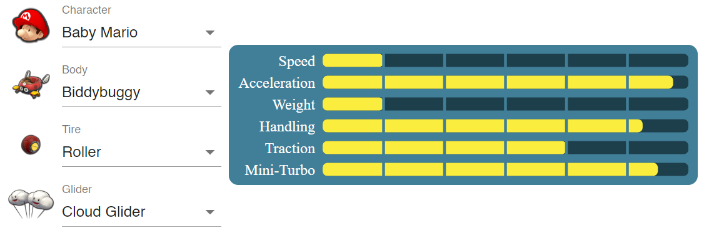
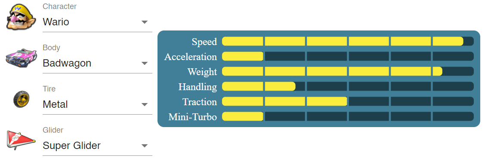

```{r setup, include=FALSE}
knitr::opts_chunk$set(echo = TRUE)
library(FrF2)
library(ggplot2)
library(ggfortify)
library(nortest)
library(MASS)
```

## Introduction 

In order to unwind and relax between all of our stressful exam preparations, we students enjoy taking a break with fun games such as Mario Kart. Competing for the first spot in thrilling races is really something that has to be experienced first-hand. Sadly, this joy is often shortlived should one be so unfortunate as to choose a poor combination of character, cart, wheel and glider, as these choices affect your weight, speed, acceleration, etc., in the game. If this combination is unfortunate with regards to your style of playing, you might end up at the back of the heat in no time, which again results in eternal shame and humiliation. 

As we have completed a significant number of laps in Mario Kart ourselves, we each have different styles of playing the game, and this is also reflected in our choices of features when we play the game ourselves. Each of us therefore has some insight into which features normally work well for our way of playing and we have used this as a starting point for our analysis. 

Through this experiment we want to gain insight into the workings of Mario Kart in order to enhance our performance in the game. This is to be done in a more quantitative than our usual "let me try these tires this time"-approach and will hopefully lead to better performance in the game. 

## Factor Selection and Levels 

The factors we want to investigate are somewhat restricted by the options in the game, or to real life factors which could affect driving performance. While real life factors, like sleep or if you ate recently, could have been interesting to look into, we decided to limit it to the choices in the game. Thus, we will investigate factors like which character you pick, if a different car-body is better and also how tires and gliders can affect time. 

We think there could be interactions between some of the factors. For instance, the characters mainly differ in weight, and this contributes to differences in top speed, acceleration and gravity, to name a few. The remaining factors all add minor changes to these same values, and we expect that a heavier character would benefit more from increased acceleration from cars, wheels and glider, than a smaller character would have. In theory, this should be present in all the interactions. However, since there are quite small changes, it could be somewhat masked by the random noise of the driver’s performance at a given test. Based on the statistics given by the game, we except the largest interaction to be between character and car-body. Also, it is worth noting that the test driver could favor certain attributes, and that the results could be influenced by that. 

For characters, we chose the layers as a heavy and a light character, namely Wario and baby Mario. Wario’s high weight grants him high speed, but low acceleration while baby Mario is agile, but not that quick at top speed. To choose the other levels we tried to make two polar opposites when it comes to cars in Mario Kart. One favours weight and speed, while the other focuses on acceleration, traction, handling and mini-turbo. Combining this with the matching characters we get the stats shown in the image. Thus, Badwagon, Metal and Super glider all focus on weight and speed while Biddybuggy, Roller and Cloud glider all are lighter and aid with acceleration and handling. We choose these levels to create as large differences as possible, so our response would be spread out. This is beneficial to reduce the impact of the random noise.  The different levels for the factors are then just which part we use, for instance Badwagon or Biddybuggy. To control that our factors are at the correct levels, we just pick the correct options in game.

Below we have shown two of the builds, using the site https://mario-kart-optimizer.netlify.app/:

A build with Baby Mario,



which optimizes acceleration and has high mini-turbo.

And a build with Wario,



which optimizes speed and has high weight, but has low acceleration and mini-turbo.

## Response Variable 

As our problem really concerns how fast a player can complete a race, we have chosen our response variable as the average time required to complete one of the three laps which constitute a race. Another possible response variable is to consider the time needed to complete one specific lap, such as the first. However, this approach can have several weaknesses. An example of this could be that the player falls off the course in the first round in one of the trials, which would affect the completion time for this lap negatively compared to other first laps where he did not fall off. By taking the average over the laps we might therefore make our approach more robust, as the effect of falling off in one lap might be reduced by taking the other laps into consideration as well. 

The response should be measured in seconds, or minutes, as the completion time for each lap normally ranges between 30 and 60 seconds. Because we used the “Time Trial” mode in Mario Kart, the game also provides us with an automatic way of recording the time needed to complete each lap, and the average for the three laps is then recorded as the response in each trial. These measurements should be rather precise, as the game itself measures them automatically, and we have not timed the laps ourselves. 

## Design 

We have chosen a $2^4$ factorial design. We have not used any blocking in our design, as we do not have any external factors which might affect the factors in the game; the speed of the vehicle is independent of the temperature or noises in the room. The performance of the player might of course be affected to some degree by such nuisance factors. We did, however, take some measures to avoid this, such that the test person was alone in the room when he played and he finished the testing in a relatively quick manner, such that tiredness should not be a factor. 

Furthermore, we have also chosen to not use replicates, as this would lead to at least 32 experiments, since we have 4 factors. Using replicates could be desirable, as lap times will vary between experiments.

## Implementation of our Experiment 

We addressed randomization by assembling the 16 different configurations in an excel window, and then using a random number generator to pick the sequence of the experiments. This is done to minimize the effects of other factors, such as learning the course over time or the driver's concentration level.  

The experiments went smoothly, and the mode “time trial” was very useful. Firstly, the game measures the time, which removes the random noise which would accompany human measurements. Secondly, the mode is single player, so the randomness of other players, human or AI, is non-existent. Furthermore, we decided to avoid using any "items" (e.g. mushrooms for additional speed) for more consistent results.


## Data Analysis
We start by loading the `.csv` file which contains the data into `R`. The factors `Character`, `Body`, `Tire` and `Time` are then changed into factor variables, with levels $1$ and $-1$. We have used the following encoding:

Character: 1 is "Baby mario", -1 is "Wario"

Body: 1 is "Buggybud", -1 is "Badwagon"

Tire: 1 is "Roller", -1 is "Metal"

Glider: 1 is "Cloud Glider", -1 is "Super Glider

```{r}
#loading the data
MarioKart.df <- read.table("MarioKart.csv", sep=";", header=T, dec = ",")
colnames(MarioKart.df)[1] = "Character" #changing the first colname to 'Character'

#Adding factors and response to a new dataframe
Character <- as.factor(ifelse(MarioKart.df$Character == "Baby mario", 1, -1))
Body <- as.factor(ifelse(MarioKart.df$Body == "Buggybud" , 1, -1))
Tire <- as.factor(ifelse(MarioKart.df$Tire == "Roller" , 1, -1))
Glider <- as.factor(ifelse(MarioKart.df$Glider == "Cloud Glider", 1, -1))
Time <- MarioKart.df$Average
Experiment.df <- data.frame(Character, Body, Tire, Glider, Time)
```

Now we fit a linear model with main effects and first order interactions against the average time spent per lap.

```{r}
#creating linear model, with 2nd order interactions
Experiment.lm <- lm(Time ~ (.)^2, data = Experiment.df)
lm.summary <- summary(Experiment.lm)
lm.summary
```

With a significance level of $\alpha = 0.05$, we get that the following terms are significant:

```{r}
alpha = 0.05
lm.summary$coefficients[, 'Pr(>|t|)'][lm.summary$coefficients[, 'Pr(>|t|)']<=alpha]
```

We see that all the main effects, except for `Glider` are significant, with `Body` having an especially low p-value. We also see that some of the interaction terms are deemed significant, meaning that picking a particular combination of vehicle parts might be important.

Now we move on to an analysis of variance.

```{r}
#ANOVA
anova <- anova(Experiment.lm)
anova
```
Again, using a significance level of $\alpha = 0.05$, we obtain that the following terms are significant for our model:

```{r}
alpha = 0.05
rownames(anova)[anova$`Pr(>F)`<=alpha]
```
Now we see that all main effects are deemed signifanct to the model, with `Body` still having the lowest p-value. 

To investigate our suspicions of `Body` having an especially high effect, we estimate the effects by multiplying the coefficients in the linear model by $2$.

```{r}
#Estimated effects
Estimated_effects <- Experiment.lm$coefficients[-1]*2
Estimated_effects[order(abs(Estimated_effects), decreasing = T)]
```

In absolute value, we see that the effect of `Body` is the highest, with `Character` and `Tire` being a little lower. We also notice that the effect of `Glider` is very small, as we suspected from the p-values discussed earlier. We can also notice the interaction term between `Character` and `Body`, which suggests that we get even better times with this combination.

Now we will look at the main effects plot, as well as the interaction plot.

```{r}
MEPlot(Experiment.lm)
```

From the main effects plot, we see that it suggests lower times for `Baby Mario`, `Buggybud`, `Roller` and `Super Glider`. We also see that we have the largest discrepancy in time for `Body`, which also suggests that this is an important feature.

```{r}
IAPlot(Experiment.lm)
```
From the interaction plot, we see that the lines are not equal for the interaction between `Character` and `Body`, which suggests that they are not independent. 

Finally, we will assess whether our linear model meets the assumptions on normality. We start by examining the residuals vs fitted values-plot, and the QQ-plot.

```{r}
autoplot(Experiment.lm, smooth.colour = NA) #Residual plot
```

From the residuals vs fitted plot, we see no clear patterns, and all residuals seem to be centered around zero. The QQ-plot also looks very good, as all residuals lie close to the dotted line.

We also use an Anderson-Darling test to investigate the normality of the residuals further.

```{r}
stdres <- stdres(Experiment.lm) #Standardized residuals
ad <- ad.test(stdres) #Anderson Darling test
```

From the Anderson-Darling test, we obtain a p-value of p=`r ad$p.value`. Since this is quite high, it suggests that the residuals are normally distributed. This, in combination with the QQ-plot and the residuals vs fitted-plot, suggests that our assumptions are met.

## Conclusion 

As shown in the analysis, the choice of components actually affects the race time. We have seen that the body was the most influential, followed by character and tires. The choice of glider was the least influential, but it still had a measurable effect. In our experiment, the best performing combination is Baby Mario, Biddybuggy, Roller and Super Glider. For the most part, these components focus on acceleration rather than speed, and this could be because the map we chose had quite a few turns. This favors rapid acceleration, while a map with less turns would favor cars with higher speed.  